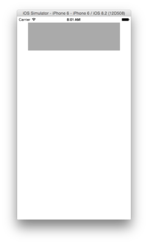
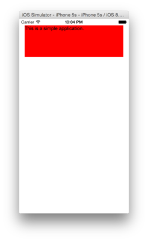

由于React并没有假设你其余部分的技术栈——它通常只作为`MVC`模型中的`V`存在——它也很容易嵌入到一个并非由React Native开发的应用当中。实际上，它可以和常见的许多工具结合，譬如[CocoaPods](http://cocoapods.org/)。

## 需求

- [CocoaPods](http://cocoapods.org/) – `gem install cocoapods`
- [Node.js](http://nodejs.org)
    - 安装 **nvm**（安装向导在[这里](https://github.com/creationix/nvm#installation)）。然后运行`nvm install node && nvm alias default node`，这将会默认安装最新版本的Node.js并且设置好命令行的环境变量，这样你可以输入`node`命令来启动Node.js环境。nvm使你可以可以同时安装多个版本的Node.js，并且在这些版本之间轻松切换。
- 在你JS代码文件所在目录下，安装React Native依赖：`npm install react-native --save`

## 通过CocoaPods安装React Native

[CocoaPods](http://cocoapods.org/)是iOS/Mac开发最常用的包管理工具。我们需要用它来引入React Native。如果你还没安装过CocoaPods，参考[这篇文章](http://guides.cocoapods.org/using/getting-started.html)。

当你准备好开始使用CocoaPods之后，往`Podfile`中增加以下的内容。如果你还没有这个文件，在你工程的根目录下创建一个。

```ruby
# 取决于你的工程如何组织，你的node_modules文件夹可能会在别的地方。
# 请将:path后面的内容修改为正确的路径。
pod 'React', :path => './node_modules/react-native', :subspecs => [
  'Core',
  'RCTImage',
  'RCTNetwork',
  'RCTText',
  'RCTWebSocket',
  # 添加其他你想在工程中使用的依赖。
]
```

记得要添加所有你需要的依赖。举例来说，`<Text>`元素如果不添加`RCTText`依赖就不能运行。

接着安装你的pods：

```
$ pod install
```

## 创建你的React Native应用

有两个地方需要准备：

1. 入口JavaScript文件必须要包含你实际的React Native应用和其他的组件。
2. 封装Objective-C代码，加载你的脚本并创建一个`RCTRootView`来显示和管理你的React Native组件。

首先，创建一个文件夹来保存你的React代码，然后创建一个`index.ios.js`文件。

```
$ mkdir ReactComponent
$ touch ReactComponent/index.ios.js
```

然后复制并粘贴一个`index.ios.js`的初始代码——这是一个简单的React Native应用：

```
'use strict';

var React = require('react-native');
var {
  Text,
  View
} = React;

var styles = React.StyleSheet.create({
  container: {
    flex: 1,
    backgroundColor: 'red'
  }
});

class SimpleApp extends React.Component {
  render() {
    return (
      <View style={styles.container}>
        <Text>This is a simple application.</Text>
      </View>
    )
  }
}

React.AppRegistry.registerComponent('SimpleApp', () => SimpleApp);
```

`SimpleApp`就是你的**模块名**，这个在后面会要用到。

## 往应用里添加容器视图

你需要添加一个容器视图来容纳React Native组件。它可以是你应用里任何的`UIView`。



不过，为了让代码更整洁，我们可以派生一个`UIView`，取名`ReactView`。打开你的`Yourproject.xcworkspace`来创建一个新的`ReactView`类（你也可以取任何你想要的名字！）

```
// ReactView.h

#import <UIKit/UIKit.h>
@interface ReactView : UIView
@end
```

在想要管理这个视图的视图管理器中，添加一个outlet然后连接它：

```
// ViewController.m

@interface ViewController ()
@property (weak, nonatomic) IBOutlet ReactView *reactView;
@end
```

__注意__：对于Swift应用来说不需要这一步。  
这里我出于简化目的禁用了**AutoLayout**。在实际生产环境中，通常你都应该打开AutoLayout并且设置相应的约束。

## 往容器视图里添加RCTRootView

准备好开始最有意思的部分了吗？现在我们要创建`RCTRootView`来包含你的React Native应用。

在`ReactView.m`中，我们需要先使用你的`index.ios.bundle`的URI来初始化`RCTRootView`。`index.ios.bundle`会由packager服务创建，可以通过React Native服务器访问到。我们会在后面讨论这个问题。

```
NSURL *jsCodeLocation = [NSURL URLWithString:@"http://localhost:8081/index.ios.bundle?platform=ios"];
// For production use, this `NSURL` could instead point to a pre-bundled file on disk:
//
//   NSURL *jsCodeLocation = [[NSBundle mainBundle] URLForResource:@"main" withExtension:@"jsbundle"];
//
// generated by "Bundle React Native code and images" build step.
//
//   curl http://localhost:8081/index.ios.bundle -o main.jsbundle
RCTRootView *rootView = [[RCTRootView alloc] initWithBundleURL:jsCodeLocation
                                                    moduleName: @"SimpleApp"
                                                 launchOptions:nil];
```

然后把它添加为`ReactView`的子视图。

```
[self addSubview:rootView];
rootView.frame = self.bounds;
```

### Swift应用

在ReactView.swift文件中添加下列代码：  

```swift
import UIKit
import React

class ReactView: UIView {

  let rootView: RCTRootView = RCTRootView(bundleURL: NSURL(string: "http://localhost:8081/index.ios.bundle?platform=ios"),
    moduleName: "SimpleApp", initialProperties: nil, launchOptions: nil)
    
  override func layoutSubviews() {
    super.layoutSubviews()

    loadReact()
  }
  
  func loadReact () {
        addSubview(rootView)
        rootView.frame = self.bounds
  }
}
```

然后确保你的视图被添加到了ViewContainer或是story board文件中。

## 启动开发服务器。

_译注_：这一部分的官方文档都有一些过时。翻译组在翻译&审校完其它部分的文档后，如果官方文档还没有更新，会帮助校正官方文档的同时翻译中文文档。

在工程的根目录下，我们可以开启React Native开发服务器：

```
(JS_DIR=`pwd`/ReactComponent; cd node_modules/react-native; npm run start -- --root $JS_DIR)
```

这条命令会启动一个React Native开发服务器，用于构建我们的bundle文件。`--root`选项用来标明你的React Native应用所在的根目录。在我们这里是`ReactComponents`目录，里面有一个`index.ios.js`文件。开发服务器启动后会打包出`index.ios.bundle`文件来，并可以通过`http://localhost:8081/index.ios.bundle`来访问。

## 更新App Transport Security

在iOS 9以上的系统中，除非明确指明，否则应用无法通过http协议连接到localhost主机。可以参考[这篇帖子](http://stackoverflow.com/questions/31254725/transport-security-has-blocked-a-cleartext-http)了解一些解决方案。

我们建议你在`Info.plist`文件中将`localhost`列为App Transport Security的例外：

```xml
<key>NSAppTransportSecurity</key>
<dict>
    <key>NSExceptionDomains</key>
    <dict>
        <key>localhost</key>
        <dict>
            <key>NSTemporaryExceptionAllowsInsecureHTTPLoads</key>
            <true/>
        </dict>
    </dict>
</dict>
```

如果不这样做，在尝试通过http连接到服务器时，会遭遇这个错误 - `Could not connect to development server.`

## 编译和运行

现在编译和运行你的应用。你应该可以看到你的React Native应用在`ReactView`内运行。



在模拟器下也可以实现热加载（需要在Build Settings -> Preprocessor Macros中设置DEBUG=1）。现在你已经拥有了一个React组件，它在Objective-C中完全表现为一个`UIView`的子类。

## 总结

在底层，当`RCTRootView`初始化完成以后，它会尝试从开发服务器下载、解析并运行打包后的脚本文件。所以你所要做的就是实现你自己的容器视图或者视图控制器，然后把`RCTRootView`作为子视图加入——接下来`RCTRootView`会搞定你的脚本文件然后渲染你的React组件。太棒了！

你可以在[这里](https://github.com/tjwudi/EmbededReactNativeExample)获得一个样例应用的完整源代码。

